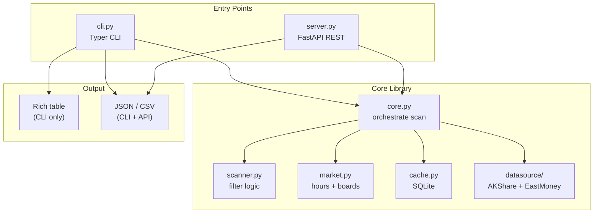
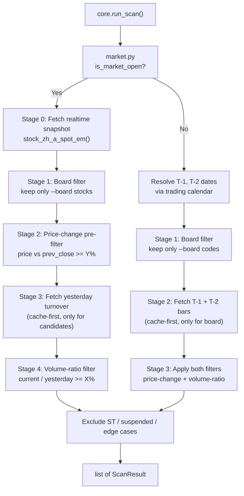

# A-Share Real-Time Scanner CLI Architecture

## Project Layout

```
aflux-cli/
├── pyproject.toml              # deps, entry point, metadata
├── aflux/
│   ├── __init__.py
│   ├── cli.py                  # Typer app, CLI args, orchestration
│   ├── server.py               # FastAPI HTTP server (aflux serve)
│   ├── core.py                 # Shared orchestration logic (used by cli.py + server.py)
│   ├── scanner.py              # Core filter logic
│   ├── models.py               # Pydantic data models (shared by CLI + API)
│   ├── market.py               # Market hours, trading calendar, board classification
│   ├── cache.py                # SQLite cache layer
│   ├── output.py               # Rich table + CSV/JSON formatting
│   └── datasource/
│       ├── __init__.py         # DataSource protocol + factory
│       ├── akshare_src.py      # AKShare implementation (primary)
│       └── eastmoney_src.py    # East Money HTTP API (fallback)
```

## Layered Architecture



**`core.py`** contains the shared `run_scan()` function that both `cli.py` and `server.py` call. This function accepts typed parameters (not CLI strings), returns a list of `ScanResult` Pydantic models, and has no I/O formatting concerns. Each entry point handles its own input parsing and output rendering.

## Data Flow (Two-Stage Filter Pipeline)

The key optimization: filter early and fetch late. Board filtering and price-change pre-filtering happen on the cheap realtime snapshot **before** any per-stock historical API calls.



### Market-open path (9:30-15:00 Beijing time, weekday, non-holiday)

- **Stage 0**: `stock_zh_a_spot_em()` returns full-market realtime snapshot (~5000 stocks) including current price, turnover (成交额), and prev_close (昨收). One API call.
- **Stage 1 -- Board filter**: Drop stocks not matching `--board` selection (e.g., `star,chinext` keeps ~2000 from 5000).
- **Stage 2 -- Price pre-filter**: Using `prev_close` already in the snapshot, compute `price_change_pct` and discard stocks below threshold. Typically reduces to a few hundred candidates. Zero extra API calls.
- **Stage 3 -- Historical fetch**: For remaining candidates only, fetch yesterday's full-day turnover from SQLite cache; on cache miss, call `stock_zh_a_hist()` per stock and cache the result. With pre-filtering, this is tens of API calls, not thousands.
- **Stage 4 -- Volume-ratio filter**: Compute `volume_ratio = today_turnover / yesterday_turnover * 100` and keep stocks >= threshold.

### Off-market path

- Determine T-1 and T-2 trading dates via trading calendar (cached, see below).
- **Optimization**: `stock_zh_a_spot_em()` returns the last trading day's final data even when called off-market. Use it as T-1 data (one bulk call) -- this provides price, turnover, and close for T-1 without per-stock fetches. Only T-2 requires per-stock `stock_zh_a_hist()` calls.
- Board-filter first to limit the stock universe.
- Fetch T-2 daily bars (cache-first) for board-filtered stocks only, apply both price-change and volume-ratio filters.

## Edge Case Handling

Applied after filtering, before output:

- **ST / \*ST stocks**: Excluded by default. Stock names matching the prefix pattern `^(*?ST|S*?ST)` are dropped. Add `--include-st` flag to override.
- **Suspended stocks**: Stocks with zero current turnover are excluded (no trading activity).
- **Newly-IPO stocks**: If T-2 data does not exist (no previous day to compare), skip gracefully.
- **Zero previous turnover**: If yesterday's turnover is 0 (e.g., resumed from suspension), skip to avoid division-by-zero.
- **Pre-market / auction period**: Between 9:15-9:30, the snapshot may contain auction data. Treat as market-open path but note in `ScanResponse.market_phase` field.

## Progress Indication

When fetching historical data on cold cache (tens to hundreds of per-stock API calls), display a Rich progress bar in TTY mode showing fetch count and ETA. Suppressed automatically when `--format json` or stdout is piped, to keep machine-readable output clean. Progress updates go to stderr only.

## CLI Interface

```
aflux scan [OPTIONS]

Options:
  --volume-ratio, -v  FLOAT   Min (current_turnover / prev_turnover * 100), default 50  [%]
  --price-change, -p  FLOAT   Min (price - prev_close) / prev_close * 100, default 2    [%]
  --board, -b         TEXT     Comma-separated board filter: star,chinext,sme,main,bse (default: all)
  --format, -f        TEXT     Output format: auto (default), table, csv, json. auto = table on TTY, json when piped.
  --export, -e        PATH    Export results to file. Format inferred from extension unless --format is explicitly csv or json.
  --source, -s        TEXT     Data source: akshare (default), eastmoney
  --cache-dir         PATH    SQLite cache directory (default: ~/.aflux/cache)
  --include-st        FLAG    Include ST/*ST stocks (excluded by default)
  --no-cache          FLAG    Skip cache, force fresh download
  --verbose           FLAG    Show debug logging
```

```
aflux cache warm [OPTIONS]

Options:
  --date              TEXT    Date to warm (default: latest trading day, YYYY-MM-DD)
  --board, -b         TEXT    Comma-separated board filter (default: all)
  --source, -s        TEXT    Data source: akshare (default), eastmoney
  --cache-dir         PATH    SQLite cache directory (default: ~/.aflux/cache)
```

Pre-populate the SQLite cache with daily bar data for all stocks (or a specific board) for a given date. Run after market close so the next day's scan hits warm cache and requires zero historical API calls. Fetches `stock_zh_a_spot_em()` for the stock code list, then calls `stock_zh_a_hist()` per stock and writes to `daily_bars` table.

```
aflux serve [OPTIONS]

Options:
  --host              TEXT    Bind host (default: 127.0.0.1)
  --port              INT     Bind port (default: 8000)
  --cors-origin       TEXT    Allowed CORS origins, comma-separated (default: *)
  --cache-dir         PATH    SQLite cache directory (default: ~/.aflux/cache)
  --source, -s        TEXT    Data source: akshare (default), eastmoney
  --rate-limit        INT     Max requests per minute per IP (default: 30)
```

### Examples

```bash
# CLI: human-readable table
aflux scan -v 80 -p 3 -b star,chinext

# CLI: JSON for LLM agent (or piped)
aflux scan -v 80 -p 3 --format json

# CLI: export to file
aflux scan -v 80 -p 3 --export results.csv

# Warm cache after market close (run daily via cron)
aflux cache warm -b star,chinext

# HTTP server for website
aflux serve --port 8000 --cors-origin http://localhost:3000
```

## Board Classification

| Board | Code prefixes |
|-------|---------------|
| STAR (科创板) | `688xxx` (Shanghai) |
| ChiNext (创业板) | `300xxx`, `301xxx` (Shenzhen) |
| SME (中小板) | `002xxx` (Shenzhen, merged into main board 2021 but codes remain) |
| BSE (北交所) | `8xxxxx` -- specifically `82xxxx`, `83xxxx`, `87xxxx`, `88xxxx` (Beijing) |
| Main (主板) | `600/601/603` (SH), `000/001` (SZ) |

Filter by matching the 6-digit stock code prefix against user-selected boards.

## SQLite Cache

- DB path: `~/.aflux/cache/market_data.db`
- Table `daily_bars`: `(code TEXT, date TEXT, open REAL, high REAL, low REAL, close REAL, turnover REAL, volume INTEGER, PRIMARY KEY (code, date))` -- turnover normalized to 元.
- Table `realtime_snapshot`: `(code TEXT, fetch_date TEXT, fetch_time TEXT, name TEXT, price REAL, turnover REAL, prev_close REAL, board TEXT, PRIMARY KEY (code, fetch_date))` -- ephemeral, full table cleared at the start of each scan run.
- Table `trading_calendar`: `(date TEXT PRIMARY KEY, updated_at TEXT)` -- cached trading calendar with 24-hour TTL. Avoids an API round-trip on every scan.
- Historical rows are immutable once written (a closed trading day's data never changes).
- Trading calendar: refreshed if `updated_at` is older than 24 hours.
- Cache-aside pattern: scanner checks cache -> on miss, fetch from datasource -> write to cache -> return.

## Turnover Normalization

AKShare returns turnover in different units depending on the API (`stock_zh_a_spot_em()` returns 元, some historical APIs return 万元). All turnover values are **normalized to 元** at the datasource layer before caching or computation. Display layer formats for readability:

- Table mode: human-readable with unit suffix (e.g., "12.3亿", "8456万")
- JSON/CSV mode: raw numeric value in 元 (e.g., `1230000000`)

## DataSource Abstraction

```python
class DataSource(Protocol):
    def fetch_realtime_snapshot(self) -> pd.DataFrame: ...
    def fetch_daily_bars(self, code: str, start: str, end: str) -> pd.DataFrame: ...
    def fetch_trading_calendar(self) -> list[str]: ...
```

- `AKShareSource` (primary): wraps `akshare.stock_zh_a_spot_em()`, `stock_zh_a_hist()`, `tool_trade_date_hist_sina()`.
- `EastMoneySource` (fallback): direct HTTP to `push2ex.eastmoney.com` JSON API for realtime snapshot; historical bars via the same AKShare functions (East Money HTTP API only covers realtime).
- Factory function selects source by `--source` flag; on AKShare failure, auto-fallback to EastMoney for realtime data.

## Scanner Logic

```python
def scan(
    current: pd.DataFrame,     # realtime snapshot or T-1 daily bars if off-market
    prev_daily: pd.DataFrame,  # yesterday (or T-2) daily bars
    volume_ratio_threshold: float,
    price_change_threshold: float,
    include_st: bool = False,
) -> list[ScanResult]:
    current_frame = exclude_edge_cases(normalize_snapshot_frame(current), include_st=include_st)
    prev_frame = normalize_daily_frame(prev_daily)
    merged = current_frame.merge(prev_frame[["code", "close", "turnover"]], on="code", suffixes=("", "_prev"))
    merged["volume_ratio_pct"] = merged["turnover"] / merged["turnover_prev"] * 100
    merged["price_change_pct"] = (merged["price"] - merged["close"]) / merged["close"] * 100
    filtered = merged[
        (merged["volume_ratio_pct"] >= volume_ratio_threshold) &
        (merged["price_change_pct"] >= price_change_threshold)
    ]
    return [_row_to_scan_result(row) for _, row in filtered.iterrows()]
```

## Core Orchestration

Shared entry point for both CLI and HTTP server:

```python
def run_scan(
    volume_ratio: float = 50.0,
    price_change: float = 2.0,
    boards: list[str] | list[Board] | str | None = None,
    source: str = "akshare",
    no_cache: bool = False,
    cache_dir: str | None = None,
    include_st: bool = False,
    progress_callback: ProgressCallback | None = None,
) -> ScanResponse:
    """Returns structured ScanResponse with results + metadata."""
    ...
```

Returns a `ScanResponse` Pydantic model that both CLI and API serialize directly.

## HTTP Server

FastAPI app launched via `aflux serve --port 8000`. The scan endpoint is a synchronous `def` (not `async def`) so FastAPI runs it in a threadpool automatically, preventing the blocking `run_scan()` call (SQLite + HTTP + pandas) from stalling the event loop under concurrent requests.

**Endpoints:**

```
GET /api/v1/scan?volume_ratio=80&price_change=3&board=star,chinext
GET /health
```

`/health` returns `{"status": "ok", "version": "0.1.0"}` for uptime monitoring. All scan endpoints are under `/api/v1/` for forward-compatible versioning.

**Response** (JSON):

```json
{
  "scan_time": "2026-05-16T10:30:00+08:00",
  "market_open": true,
  "count": 12,
  "results": [
    {
      "code": "300123",
      "name": "某某科技",
      "price": 25.60,
      "price_change_pct": 5.23,
      "volume_ratio_pct": 185.4,
      "turnover": 1230000000,
      "prev_turnover": 663400000,
      "board": "chinext"
    }
  ]
}
```

- CORS enabled (configurable origins via `--cors-origin` flag or env var).
- Structured error responses with HTTP status codes and detail messages.
- Basic per-IP rate limiting (default: 30 req/min) to prevent abuse when exposed to a frontend. Configurable via `--rate-limit` flag.
- `--host` and `--port` flags for bind configuration.

## LLM Agent Integration (CLI)

LLM agents call the scanner via shell with `--format json`:

```bash
aflux scan -v 80 -p 3 -b star,chinext --format json
```

Design choices for LLM-friendliness:

- `--format json` writes **only** valid JSON to stdout (no Rich decorations, no progress bars, no log lines mixed in). All diagnostic output goes to stderr.
- Deterministic, parseable output structure (same shape as the API response above).
- Non-zero exit code on errors with JSON error body on stderr: `{"error": "message"}`.
- `--format json` is the default when stdout is not a TTY (piped), so `aflux scan | jq .` works without explicit `--format json`.

## Output

- **Table** (human/TTY): Rich `Table` with columns: Code, Name, Price, Change%, VolumeRatio%, CurrentTurnover. Sorted by VolumeRatio descending.
- **JSON**: Pydantic `.model_dump_json()` of `ScanResponse` -- shared schema between CLI and API.
- **CSV**: Write to stdout or file via `--export`. Headers match JSON field names.

## Models

Pydantic `BaseModel` for type safety and serialization (shared by CLI + API):

- `StockSnapshot`: code, name, price, turnover, prev_close
- `DailyBar`: code, date, open, high, low, close, turnover, volume
- `ScanResult`: code, name, price, price_change_pct, volume_ratio_pct, turnover, prev_turnover, board
- `ScanResponse`: scan_time, market_open, market_phase, count, results (list of ScanResult) -- the top-level envelope

## Key Design Decisions

- **Core/entrypoint separation**: `core.py` contains all business logic and returns Pydantic models. `cli.py` and `server.py` are thin entry points that handle I/O only. This makes the scanner trivially callable from any Python context.
- **Single shared response schema**: `ScanResponse` Pydantic model is the contract for CLI JSON output, API response, and programmatic callers. One schema to document, test, and version.
- **TTY-aware default format**: `--format table` when interactive, `--format json` when piped. LLM agents and scripts get clean JSON without needing to remember the flag.
- **Single-shot execution**: one scan per invocation, composable with `cron` / `watch` for loops.
- **Pandas for data wrangling**: AKShare already returns DataFrames; keep the pipeline in Pandas for simplicity.
- **SQLite over file-based cache**: queryable, single-file, no serialization format decisions, atomic writes.
- **AKShare `stock_zh_a_spot_em()` as primary realtime source**: returns entire A-share market in one call (~5000 stocks), includes current turnover and prev_close, so for market-open scans we may only need this single API call + cached yesterday turnover (if the realtime snapshot doesn't include yesterday's full-day turnover, we fetch and cache it).

## Dependencies (`pyproject.toml`)

- `typer[all]` -- CLI framework + Rich integration
- `rich` -- terminal table output
- `fastapi` -- HTTP server for website integration
- `uvicorn` -- ASGI server for FastAPI
- `akshare` -- A-share market data
- `pandas` -- data manipulation
- `pydantic` -- data models (shared by CLI + API)
- `httpx` -- East Money direct API calls (async-capable, modern)
- `slowapi` -- per-IP rate limiting for FastAPI server
