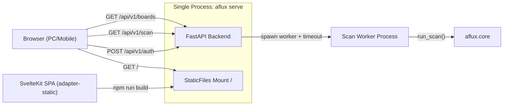
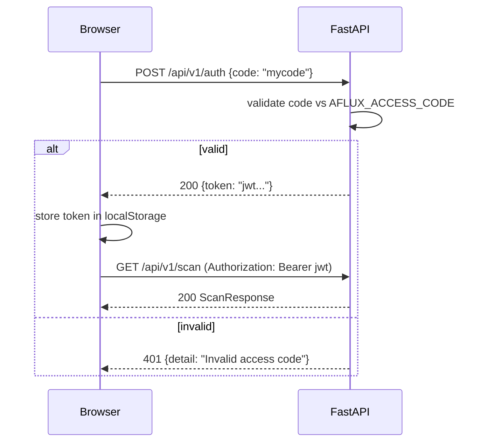

# aflux Web App Plan

## Architecture



**Single-port deployment:** FastAPI serves the built SvelteKit static files at `/` and API routes at `/api/v1/*`. One `aflux serve` command runs everything. Unknown API paths return JSON 404s; only non-API paths fall back to the SPA shell.

## Project Structure

```
web/                          # SvelteKit project (new)
  src/
    lib/
      api.ts                  # fetch wrapper with auth token
      stores.ts               # Svelte stores: auth, query params, results
      format.ts               # turnover formatting (亿/万), color helpers
    routes/
      +layout.svelte          # responsive shell, auth guard
      +page.svelte            # login page
      scan/+page.svelte       # main scan dashboard
    app.html
  static/
    manifest.json             # PWA manifest (Phase 3)
  svelte.config.js            # adapter-static, paths config
  package.json
aflux/
  server.py                   # extended: auth endpoint, static mount, auth middleware
  settings.py                 # new: Pydantic BaseSettings loading .env
.env                          # AFLUX_ACCESS_CODE=<passcode>
.env.example                  # template with placeholder
Makefile                      # build-web, dev, serve, clean (Phase 3)
```

---

## Phase 1 — MVP (end-to-end working product)

Goal: user can open browser, enter passcode, configure scan params, see results in a responsive table.

### Backend

**1a. Dependencies** — add to `pyproject.toml`: `pydantic-settings`, `PyJWT`, `python-dotenv`

**1b. `aflux/settings.py`** — Pydantic `BaseSettings` loading from `.env`:
- `access_code: str` — the login passcode
- `token_secret: str` — JWT signing key (auto-generated default via `secrets.token_urlsafe`)
- `token_expire_minutes: int = 1440` (24h)
- `scan_timeout_seconds: int = 120`

**1c. `.env.example`** — template; add `.env` to `.gitignore`

**1d. Auth in `aflux/server.py`**:
- `POST /api/v1/auth` — accepts `{"code": "..."}`, validates vs `settings.access_code`, returns JWT. Rate limited at 5/min per IP.
- `get_current_user()` dependency — extracts Bearer token, validates JWT, raises 401 on failure
- Apply auth to `GET /api/v1/scan`; `GET /health` stays public

**1e. New endpoints**:
- `GET /api/v1/boards` (no auth) — returns available boards from `market.ALL_BOARDS`
- Scan timeout: run `run_scan()` in an isolated worker process; terminate the worker and return 504 when `settings.scan_timeout_seconds` elapses

**1f. Static mount** — serve `web/build/` at `/` with `html=True` for SPA fallback; only mount if dir exists. Add `--web-dir` option to `aflux serve` CLI. Preserve API 404 behavior by excluding `/api/*` from SPA fallback.

### Frontend

**1g. Scaffold** — SvelteKit + `adapter-static` (SPA, `fallback: "index.html"`), Tailwind CSS v4, TypeScript. Build output: `web/build/`.

**1h. Vite proxy** — `vite.config.ts` proxies `/api` and `/health` to `http://localhost:8000` for dev.

**1i. API client** (`web/src/lib/api.ts`) — fetch wrapper that:
- Attaches `Authorization: Bearer <token>` from localStorage
- On authenticated API 401: clears token, redirects to login
- On login 401: shows the server validation error without clearing an existing session redirect state

**1j. Stores** (`web/src/lib/stores.ts`):
- `authToken` — writable, synced to localStorage
- `scanParams` — writable (volume_ratio, price_change, boards, include_st, no_cache), synced to localStorage
- `scanResults` — writable, holds latest `ScanResponse`

**1k. Login page** (`/`) — centered passcode input + submit. On success: store JWT, redirect to `/scan`.

**1l. Dashboard** (`/scan`):
- Query form: volume ratio (number input), price change (number input), board multi-select (fetch from `/api/v1/boards`), include ST toggle, no-cache toggle
- Manual "Scan" button
- Results table (desktop) / card list (mobile). Columns: code, name, price, change%, vol ratio%, turnover, prev turnover, board
- Status bar: scan time, market phase badge, result count
- Responsive: Tailwind breakpoints, collapsible filter panel on mobile

**Checkpoint:** after Phase 1, `aflux serve` gives a fully working web scanner.

---

## Phase 2 — Polish (visual quality + UX refinement)

Goal: the dashboard feels polished, data-dense, and finance-native.

**2a. Dark mode** — default dark theme, light/dark toggle in nav bar, preference in localStorage. Tailwind `darkMode: "class"`.

**2b. Chinese market colors** — red text for positive price change (up), green for negative (down). Matching A-share convention.

**2c. Turnover formatting** — TypeScript port of `format_turnover()` from `aflux/output.py`:

```typescript
function formatTurnover(value: number): string {
  if (value >= 1_0000_0000) return `${(value / 1_0000_0000).toFixed(2)}亿`;
  if (value >= 1_0000) return `${(value / 1_0000).toFixed(2)}万`;
  return value.toFixed(0);
}
```

**2d. Column sorting** — clickable table headers cycle desc/asc/none. None preserves API result order. Sort dropdown + direction button on mobile. Pure client-side on in-memory results.

**2e. Export** — download button with CSV/JSON selector. Generates blob from current results, triggers `<a download>`.

**2f. Loading state** — skeleton rows / spinner overlay during scan. Disable "Scan" button while loading.

**2g. Error handling**:
- Error banners (dismissible) for 500 / network failures with "Retry" button
- 429 rate-limit: "Rate limited — retrying in Xs" with countdown, auto-retry
- Offline: persistent banner on `navigator.onLine` change, disable scan

**2h. URL params** — sync query params to URL: `/scan?v=80&p=3&b=star,chinext`. Priority: URL > localStorage > defaults. Use SvelteKit `goto()` with `replaceState`.

**2i. Data staleness indicator** — "Last updated: Xs ago" next to scan time. Ticks up every second via `setInterval`. Color-coded: green (<30s), yellow (30-120s), red (>120s).

**2j. Dynamic tab title** — update `document.title` to `"aflux (23) — Intraday"` or `"aflux — Off Market"` reflecting result count and market phase.

**Checkpoint:** after Phase 2, the dashboard is visually polished and production-quality.

---

## Phase 3 — Delight (auto-refresh, PWA, tooling)

Goal: power-user features and mobile-native experience.

**3a. Auto-refresh**:
- Toggle switch + interval selector (15s / 30s / 60s / 120s)
- `setInterval` fires scan API calls
- Auto-pause on `document.visibilitychange` (tab hidden)
- Countdown timer to next refresh
- Disable when market phase is `off_market`

**3b. Market countdown** — live countdown in status bar: "Closes in 1h 23m" / "Opens in 18h 45m". Computed from Asia/Shanghai time vs 09:30/15:00 boundaries.

**3c. Pull-to-refresh** — touchstart/touchmove/touchend gesture on mobile triggers a scan. Visual pull indicator.

**3d. PWA**:
- `web/static/manifest.json`: app name "aflux", theme_color dark, display standalone
- Minimal service worker (app shell cache only, not API data)
- Link in `app.html` `<head>`, register SW in `+layout.svelte`

**3e. Root Makefile**:
- `make build-web` — `cd web && npm ci && npm run build`
- `make dev` — starts Vite dev server + `aflux serve` in parallel; traps exit/interruption and stops the backend process
- `make serve` — production: `aflux serve`
- `make clean` — removes `web/build/`, `web/node_modules/`

**Checkpoint:** after Phase 3, the app is a polished PWA with auto-refresh and one-command builds.

---

## Auth Flow



## Build and Dev Workflow

- **Dev**: `make dev` starts `aflux serve` on :8000 and `npm run dev` in `web/` (Vite on :5173); Vite proxies `/api` to FastAPI and Make cleanup stops the backend on exit
- **Prod**: `cd web && npm run build` then `aflux serve` serves everything from one port
- **Makefile** (Phase 3): `make dev`, `make build-web`, `make serve`, `make clean`
